### 1、使用Redis实现分布式部署单点登录（单点登录第一种方法：redis分布式存储解决方案）

- 为什么会存在单点登录的问题
  - **session默认是存储在当前服务器的内存中**，如果是集群，那么只有登录那台机器的内存中才有这个session
  - 比如说我在A机器登录，B机器是没有这个session存在的，所以需要重新验证
- 如何解决这个单点登录问题
  - 不管在那一台web服务器登录，都会把token值存放到我们的一个集中管理的redis服务器中
  - 但客户端携带token验证的时候，会先从redis中获取，就实现单点登录
- 现实举例
  - 比如你写的一个tornado项目，分别部署到A，B两台机器上
  - 如果直接使用session，那么如果在A机器登录，token只会在A服务器的内存
  - 因为请求会封不到A，b连个机器，如果这个请求到了B机器，B的内存中没有就会让重新登录
  - 所以登录A机器的时候我们应该把token值写入到redis中，A/B机器登录，都从redis中获取token进行校验

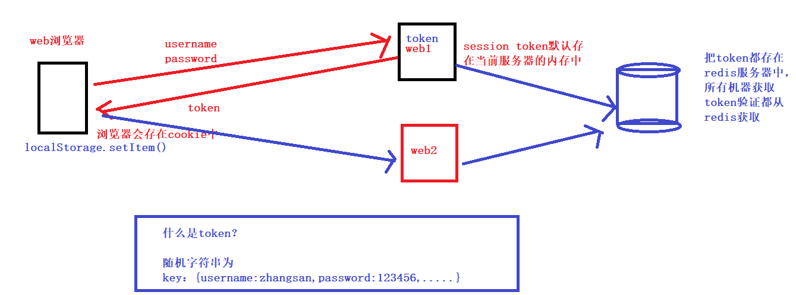


### 2.基于JWT技术及RSA非对称加密实现真正无状态的单点登录（单点等第二种方法：JWT）


###  3.用户登录对接QQ、微信、微博等三方登录


### 4.基于 Django 的后台管理平台，采用 RBAC 权限管理机制

- 用户表、角色表、权限表

###  5.结合DRF框架提供标准RESTful API接口

<https://www.cnblogs.com/xiaonq/p/10053234.html>

RESTful不是一种技术，而是一种接口规范，主要规范包括：1.请求方式、2.状态码、3、url规范、4、传参规范

- 请求方式method
  - GET ：从服务器取出资源（一项或多项）
  - POST ：在服务器新建一个资源
  - PUT ：在服务器更新资源（客户端提供改变后的完整资源）
  - PATCH ：在服务器更新资源（客户端提供改变的属性）
  - DELETE ：从服务器删除资源
- **状态码**

```
'''1. 2XX请求成功'''
# 200 请求成功，一般用于GET与POST请求
# 201 Created - [POST/PUT/PATCH]：用户新建或修改数据成功。
# 202 Accepted - [*]：表示一个请求已经进入后台排队（异步任务）
# 204 NO CONTENT - [DELETE]：用户删除数据成功。
'''2. 3XX重定向'''
# 301 NO CONTENT - 永久重定向
# 302 NO CONTENT - 临时重定向
'''3. 4XX客户端错误'''
# 400 INVALID REQUEST - [POST/PUT/PATCH]：用户发出的请求有错误。
# 401 Unauthorized - [*]：表示用户没有权限（令牌、用户名、密码错误）。
# 403 Forbidden - [*] 表示用户得到授权（与401错误相对），但是访问是被禁止的。
# 404 NOT FOUND - [*]：用户发出的请求针对的是不存在的记录。
# 406 Not Acceptable - [GET]：用户请求的格式不可得（比如用户请求JSON格式，但是只有XML格式）。
# 410 Gone -[GET]：用户请求的资源被永久删除，且不会再得到的。
# 422 Unprocesable entity - [POST/PUT/PATCH] 当创建一个对象时，发生一个验证错误。
'''4. 5XX服务端错误'''
# 500 INTERNAL SERVER ERROR - [*]：服务器内部错误，无法完成请求
# 501 Not Implemented     服务器不支持请求的功能，无法完成请求
```

- 面向资源编程： 路径，视网络上任何东西都是资源，均使用名词表示（可复数）
  - 所有请求实际操作的都是数据库中的表，每一个表当做一个资源
  - 资源是一个名称，所以RESTful规范中URL只能有名称或名词的复数形式
  - <https://api.example.com/v1/zoos>
  - <https://api.example.com/v1/animals>
  - <https://api.example.com/v1/employees>
- 过滤，通过在url上传参的形式传递搜索条件
  - <https://api.example.com/v1/zoos?limit=10：指定返回记录的数量>
  - <https://api.example.com/v1/zoos?offset=10：指定返回记录的开始位置>
  - <https://api.example.com/v1/zoos?page=2&per_page=100：指定第几页，以及每页的记录数>
  - <https://api.example.com/v1/zoos?sortby=name&order=asc：指定返回结果按照哪个属性排序，以及排序顺序>
  - <https://api.example.com/v1/zoos?animal_type_id=1：指定筛选条件>

> #### django的DRF

<https://www.cnblogs.com/xiaonq/p/10987889.html>

- 认证
- 权限
- 序列化
- 版本号
- 限流

### 6.借助xterm.js、paramiko、Dwebsocket、SSH完成WebSSH在线编程

websocket：<https://www.cnblogs.com/xiaonq/p/12238651.html>

webssh：<https://www.cnblogs.com/xiaonq/p/12243024.html>

> #### 1.**什么是WebSSH?**

- webssh 泛指一种技术可以在网页上实现一个 SSH 终端。
- ssh终端：用来通过ssh协议，连接服务器进行管理
- 运维开发方向：堡垒机登录、线上机器管理（因为运维人员不肯能24小时携带电脑）
- 在线编程：提供一个编程环境

> #### 2.websocket(3w1h)

- 什么是websocket

  - webSocket是一种在单个TCP连接上进行全双工通信的协议
  - 客户端和服务器之间的数据交换变得更加简单，**允许服务端主动向客户端推送数据**。
  - 浏览器和服务器只需要完成一次握手，两者之间就直接可以创建持久性的连接，并进行双向数据传输

- websocket与http区别

  - http请求建立连接只能发送一次请求,不能有服务器端主动向客户端发送请求
  - websocket建立的长连接，一次连接，后续一直通信，这样节省资源，可以有客户端发送请求给服务器端

- 远古时期解决方案就是轮询

  - 客户端以设定的时间间隔周期性地向服务端发送请求，频繁地查询是否有新的数据改动（浪费流量和资源）

- webSocket应用场景？

  - **聊天软件：**最著名的就是微信，QQ，这一类社交聊天的app
  - **弹幕：**各种直播的弹幕窗口
  - **在线教育：**可以视频聊天、即时聊天以及其与别人合作一起在网上讨论问题…

- websocket原理

  - websocket首先借助http协议（通过在http头部设置属性，请求和服务器进行协议升级，升级协议为websocket的应用层协议）
  - 建立好和服务器之间的数据流，数据流之间底层还是依靠TCP协议；
  - websocket会接着使用这条建立好的数据流和服务器之间保持通信；
  - 由于复杂的网络环境，数据流可能会断开，在实际使用过程中，我们在onFailure或者onClosing回调方法中，实现重连

- websocket

  实现心跳检测的思路

  - 通过setInterval定时任务每个3秒钟调用一次reconnect函数
  - reconnect会通过socket.readyState来判断这个websocket连接是否正常
  - 如果不正常就会触发定时连接，每4s钟重试一次，直到连接成功
  - 如果是网络断开的情况下，在指定的时间内服务器端并没有返回心跳响应消息，因此服务器端断开了。
  - 服务断开我们使用ws.close关闭连接，在一段时间后，可以通过 onclose事件监听到。

### 7.redis集群实现秒杀和解决超卖问题

- **redis命令：**<https://www.cnblogs.com/xiaonq/p/7919111.html>
- **redis解决超卖问题：**<https://www.cnblogs.com/xiaonq/p/12328934.html>


### 8.集成支付宝、微信、银联等进行聚合支付(怎么保证接口安全)

支付宝支付：<https://www.cnblogs.com/xiaonq/p/12332990.html>

- 相关的资源：appid、支付宝公钥、app公钥、app私钥、django环境
- 流程
  - 生成公钥（app公钥、app私钥）
  - APP的公钥要上传到沙箱环境，然后我们要下载支付宝公钥
- 代码如何实现
  - 第一：生成支付的url
    - 在电脑本地生成公钥、私钥（app公钥、app私钥）
    - APP的公钥要上传到沙箱环境，然后我们要下载支付宝公钥
    - 提供（实例化Alipay对象）：appid、支付宝公钥、app私钥
    - 提供（拼接付款的url）：订单id、金额、标题、return_url(付款成功的回调接口)、notify_url(付款成功后的异步通知)
  - 第二：主动查询支付结果
    - 提供（实例化Alipay对象）：appid、支付宝公钥、app私钥
    - 提供一个 订单id就可以查询当前订单支付结果
  - 非对称加密保证数据安全的原理
    * django app端-->Alipay公钥（data）加密--->支付宝server端Alipay私钥解密
    * 支付宝server端--->APP公钥（data）加密--->django app端--->django端私钥解密

- 支付宝是如何保证数据安全的（数据传输如何保证安全）


### 9.课程加入路径celery触发更新提醒

- celery原理


- celery应用场景
  - 异步任务
    - 发邮件、发送消息
    - 自动化工单中耗时任务
    - 所有需要异步处理的请求都可以
  - 定时任务
    - 工单系统定时获取超时工单进行延时报警
    - 对过期会员进行清理
- celery的场景（生产者消费者）可以使用多线程解决吗
  - 前端发送一个请求，执行自动化工单需要半个小时，这时候如果使用多线程页面会等待吗？
  - 

### 10.进程

- 进程

  <https://www.cnblogs.com/xiaonq/p/7905347.html#i3>

  - **进程是资源分配的最小单位（ 内存、cpu、网络、io）**
  - 一个运行起来的程序就是一个进程
    - 什么是程序（程序是我们存储在硬盘里的代码）
    - 硬盘（256G）、内存条（8G）
    - 当我们双击图标，打开程序的时候，实际上就是通过I/O操作（读写）内存条里面
    - 内存条就是我们所指的资源
    - CPU分时
      - CPU比你的手速快多了，分时处理每个线程，但是由于太快然你觉得每个线程都是独占cpu
      - cpu是计算，只有时间片到了，获取cpu，线程真正执行
      - 当你想使用 网络、磁盘等资源的时候，需要cpu的调度
  - 进程具有独立的内存空间，所以没有办法相互通信
    - 进程如何通信
      - 进程queue：父子进程间通信
      - pipe：实现两个进程间通信
      - managers：实现多进程间数据共享
      - RabbitMQ、redis等
  - 为什么需要进程池
    - 一次性开启指定数量的进程
    - 如果有十个进程，有一百个任务，一次可以处理多少个（一次性只能处理十个）
    - 防止进程开启数量过多导致服务器压力过大

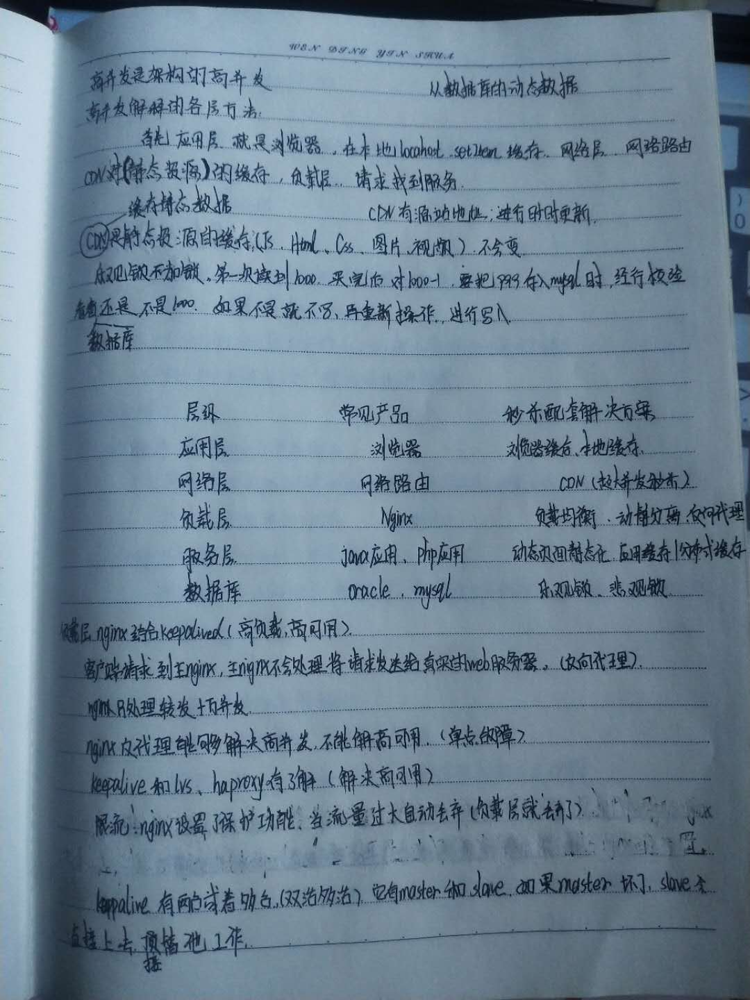
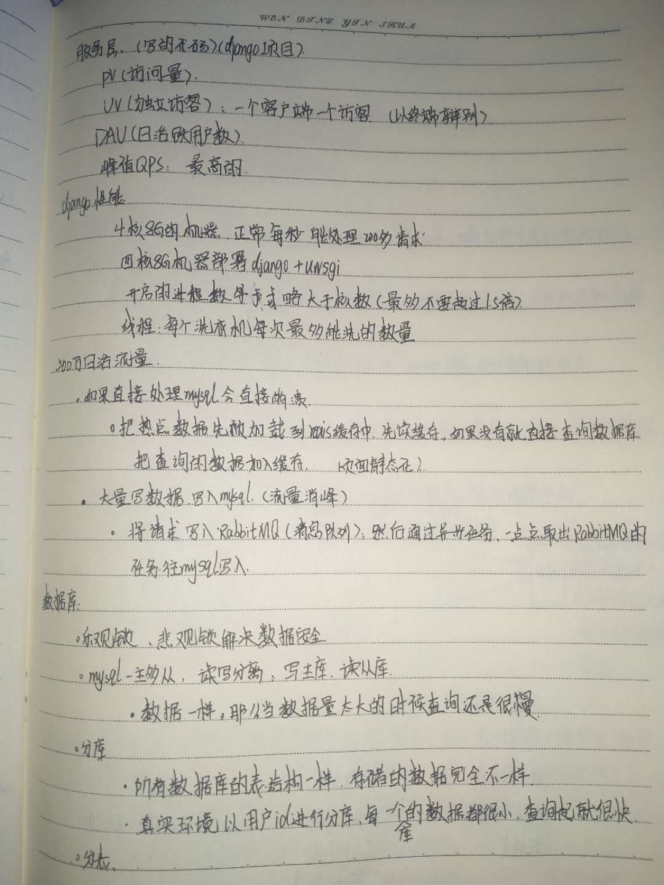
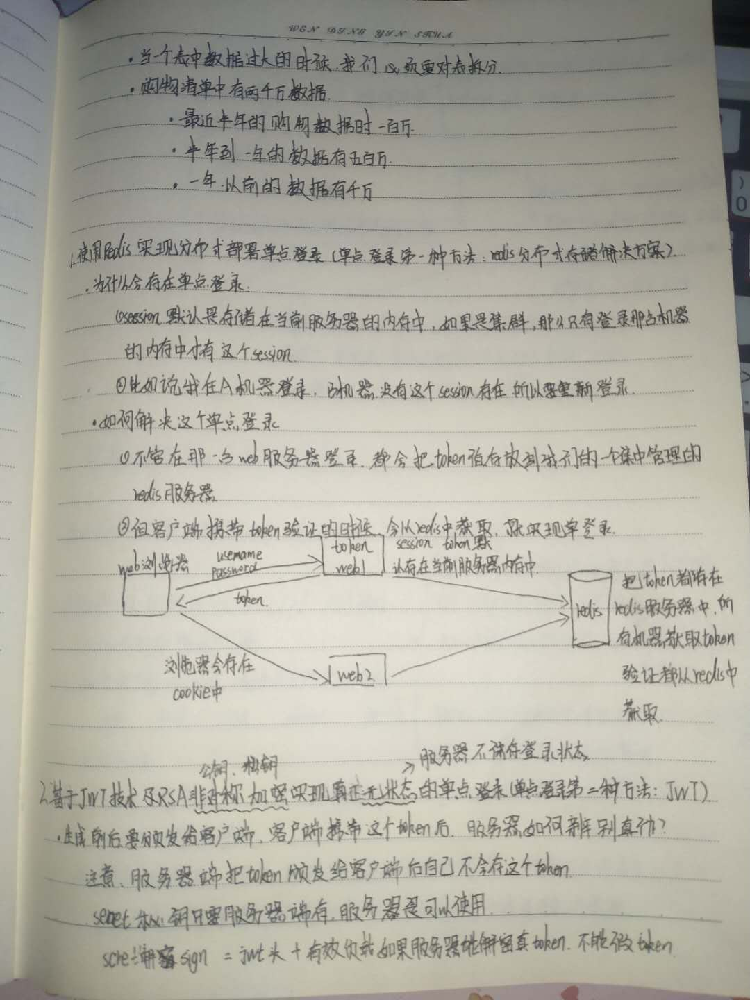
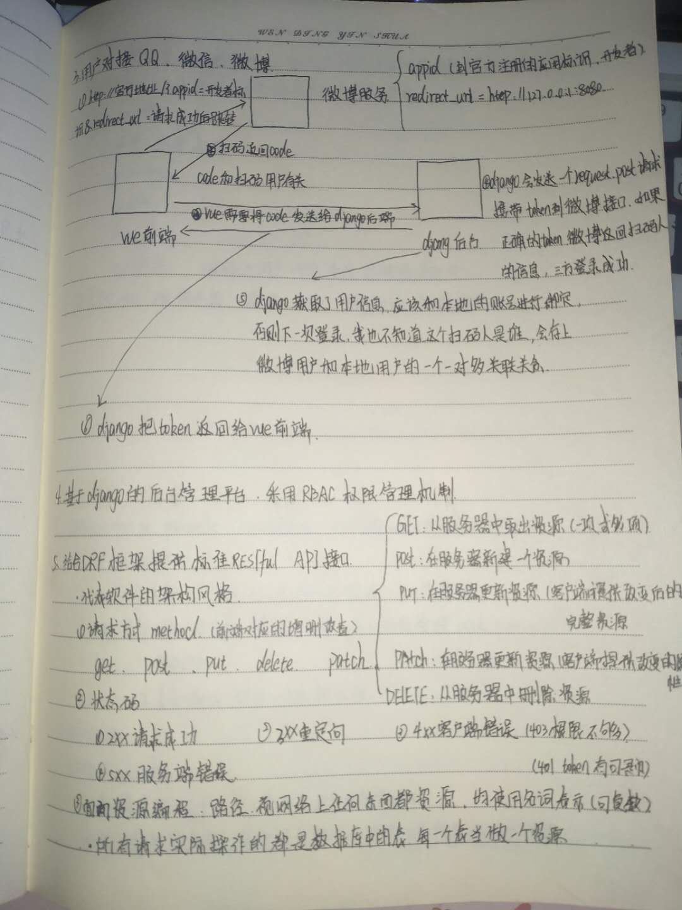
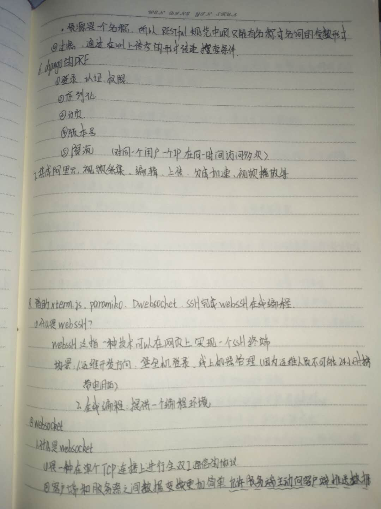
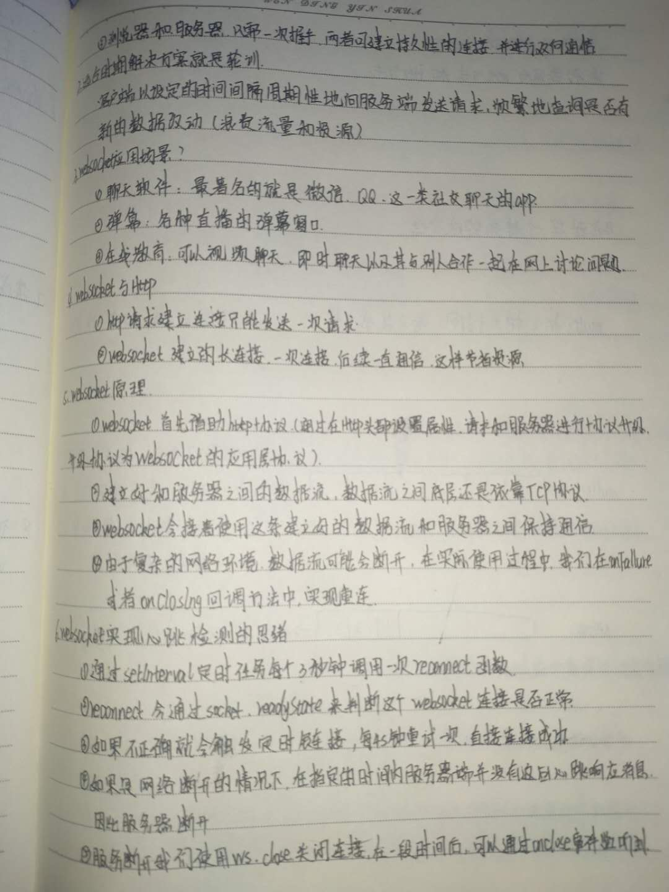
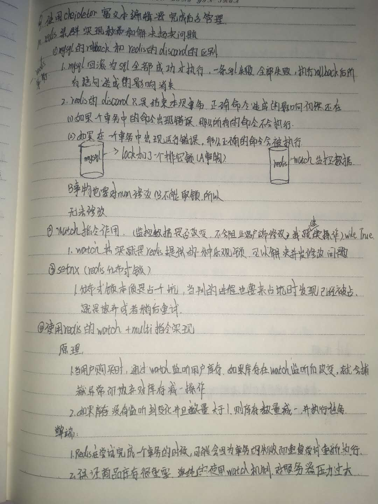


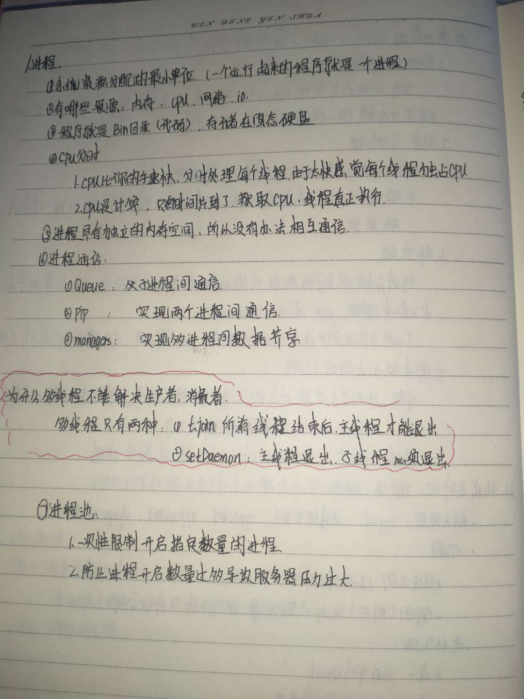
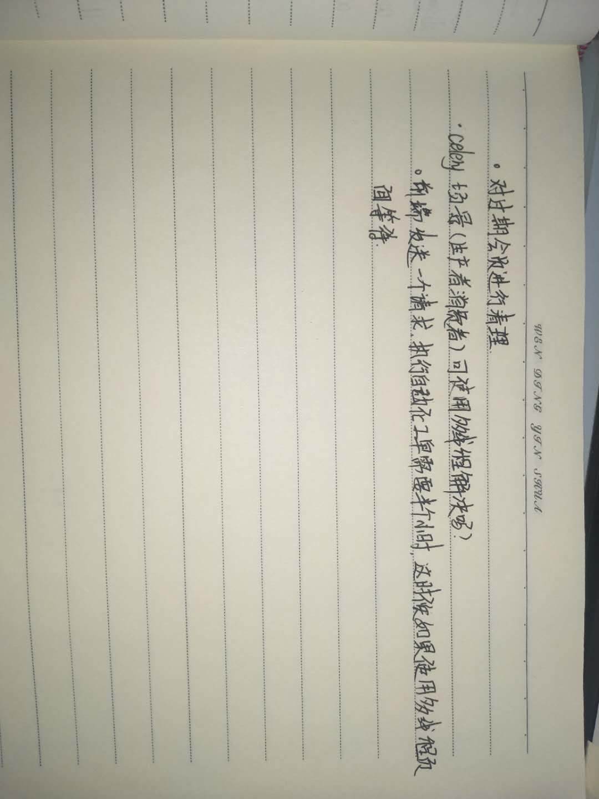
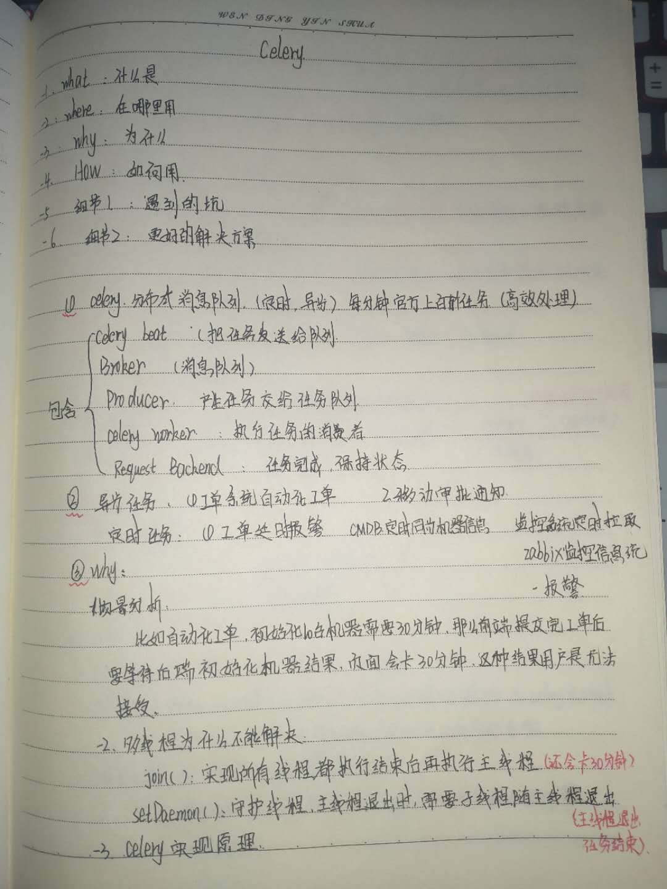
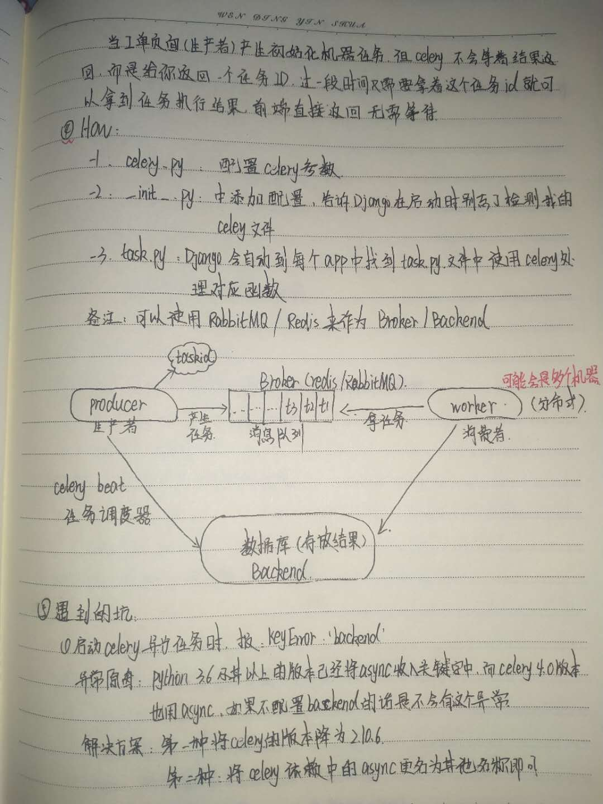